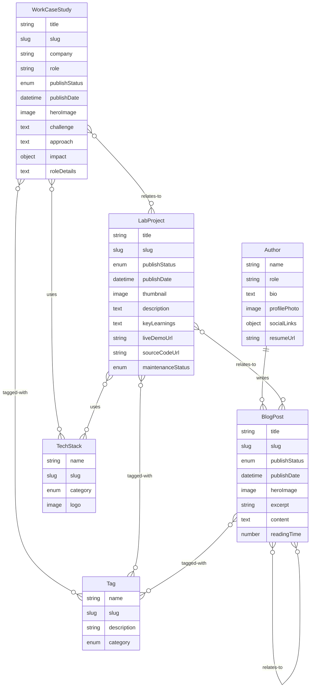

# Data Model

**Feature**: Portfolio Website  
**Date**: October 28, 2025  
**Purpose**: Define content entities, attributes, relationships, and validation rules

---

## Content Entities

### 1. Author

Represents the portfolio owner (site author).

**Attributes:**

- `_id`: string (Sanity document ID, auto-generated)
- `_type`: 'author' (literal)
- `name`: string (required, e.g., "Jason Bui")
- `role`: string (required, e.g., "Frontend Engineer")
- `bio`: Portable Text (required, professional bio, 200-500 words)
- `profilePhoto`: Image (required, aspect ratio 1:1, min 400×400px)
- `socialLinks`: Object (required)
  - `linkedin`: string (URL, required)
  - `github`: string (URL, required)
  - `twitter`: string (URL, optional)
- `resumeUrl`: string (URL to PDF resume, required)

**Validation Rules:**

- Name: 2-50 characters
- Role: 2-100 characters
- Bio: 200-500 words
- Profile photo: JPEG/PNG/WebP, max 2MB
- Social links: Valid HTTPS URLs
- Resume URL: Valid HTTPS URL ending in `.pdf`

**Relationships:**

- One author per site (singleton pattern)
- Referenced by all BlogPost documents as author

---

### 2. WorkCaseStudy

Represents a detailed work experience case study.

**Attributes:**

- `_id`: string (Sanity document ID, auto-generated)
- `_type`: 'workCaseStudy' (literal)
- `title`: string (required, 5-80 characters, e.g., "Redesigning Checkout Flow for 40% Conversion Lift")
- `slug`: Slug (required, unique, auto-generated from title with numeric suffix for duplicates)
- `company`: string (required, 2-50 characters)
- `role`: string (required, e.g., "Lead Frontend Engineer", "Senior IC")
- `publishStatus`: string (required, enum: 'draft' | 'published' | 'archived')
- `publishDate`: datetime (required, ISO 8601 format)
- `heroImage`: Image (required, aspect ratio 16:9, min 1200×675px)
- `challenge`: Portable Text (required, 100-300 words describing the problem)
- `approach`: Portable Text (required, 300-800 words describing technical solution)
- `impact`: Object (required)
  - `metrics`: Array of Metric objects (required, 1-5 items)
    - `label`: string (e.g., "Conversion Rate")
    - `before`: string (e.g., "2.8%")
    - `after`: string (e.g., "3.9%")
    - `improvement`: string (e.g., "+40%")
  - `narrative`: Portable Text (100-200 words summarizing impact)
- `techStack`: Array of TechStack references (required, 3-10 items)
- `roleDetails`: Portable Text (required, 100-300 words describing responsibilities)
- `visuals`: Array of Image (optional, 0-8 items, screenshots/diagrams)
- `tags`: Array of Tag references (required, 2-8 items)
- `relatedProjects`: Array of LabProject references (optional, 0-3 items)

**Validation Rules:**

- Title: 5-80 characters, no special characters
- Slug: lowercase, hyphen-separated, unique within workCaseStudy type
- Slug conflict resolution: append `-2`, `-3`, etc. for duplicates
- Company: 2-50 characters
- Role: 2-50 characters
- Hero image: JPEG/PNG/WebP, max 5MB, aspect ratio 16:9
- Challenge: 100-300 words
- Approach: 300-800 words
- Impact metrics: 1-5 items, all fields required
- Tech stack: 3-10 items
- Role details: 100-300 words
- Tags: 2-8 items
- Related projects: 0-3 items

**Relationships:**

- Many-to-many with TechStack (via references)
- Many-to-many with Tag (via references)
- Many-to-many with LabProject (via relatedProjects)

**State Transitions:**

- `draft` → `published`: Author publishes case study, triggers webhook
- `published` → `archived`: Case study removed from public lists, accessible via direct URL
- `archived` → `published`: Case study restored to public lists

---

### 3. LabProject

Represents a side project or experiment.

**Attributes:**

- `_id`: string (Sanity document ID, auto-generated)
- `_type`: 'labProject' (literal)
- `title`: string (required, 5-80 characters)
- `slug`: Slug (required, unique, auto-generated from title with numeric suffix for duplicates)
- `publishStatus`: string (required, enum: 'draft' | 'published' | 'archived')
- `publishDate`: datetime (required, ISO 8601 format)
- `thumbnail`: Image (required, aspect ratio 16:9, min 800×450px)
- `description`: Portable Text (required, 100-300 words describing what was built)
- `keyLearnings`: Portable Text (required, 100-300 words describing what was learned)
- `techStack`: Array of TechStack references (required, 2-8 items)
- `liveDemoUrl`: string (URL, optional)
- `sourceCodeUrl`: string (URL, optional)
- `maintenanceStatus`: string (required, enum: 'active' | 'archived')
- `tags`: Array of Tag references (required, 2-8 items)
- `relatedBlogPosts`: Array of BlogPost references (optional, 0-3 items)

**Validation Rules:**

- Title: 5-80 characters
- Slug: lowercase, hyphen-separated, unique within labProject type
- Slug conflict resolution: append `-2`, `-3`, etc. for duplicates
- Thumbnail: JPEG/PNG/WebP, max 3MB, aspect ratio 16:9
- Description: 100-300 words
- Key learnings: 100-300 words
- Tech stack: 2-8 items
- Live demo URL: Valid HTTPS URL (if provided)
- Source code URL: Valid HTTPS URL (if provided)
- Tags: 2-8 items
- Related blog posts: 0-3 items

**Relationships:**

- Many-to-many with TechStack (via references)
- Many-to-many with Tag (via references)
- Many-to-many with BlogPost (via relatedBlogPosts)
- Many-to-many with WorkCaseStudy (reverse of relatedProjects)

**State Transitions:**

- `draft` → `published`: Author publishes project, triggers webhook
- `published` → `archived`: Project removed from public lists
- `archived` → `published`: Project restored to public lists
- Maintenance status: Independent of publish status, indicates if actively maintained

---

### 4. BlogPost

Represents a blog article.

**Attributes:**

- `_id`: string (Sanity document ID, auto-generated)
- `_type`: 'blogPost' (literal)
- `title`: string (required, 5-120 characters)
- `slug`: Slug (required, unique, auto-generated from title with numeric suffix for duplicates)
- `publishStatus`: string (required, enum: 'draft' | 'published' | 'archived')
- `publishDate`: datetime (required, ISO 8601 format)
- `author`: Reference to Author (required)
- `heroImage`: Image (optional, aspect ratio 16:9, min 1200×675px)
- `excerpt`: string (required, 100-200 characters, plain text summary)
- `content`: Portable Text (required, 500-5000 words)
- `readingTime`: number (required, calculated from word count, minutes)
- `tags`: Array of Tag references (required, 1-8 items)
- `relatedPosts`: Array of BlogPost references (optional, 0-3 items, auto-calculated from shared tags)

**Validation Rules:**

- Title: 5-120 characters
- Slug: lowercase, hyphen-separated, unique within blogPost type
- Slug conflict resolution: append `-2`, `-3`, etc. for duplicates
- Excerpt: 100-200 characters, plain text only
- Content: 500-5000 words
- Reading time: Calculated as `wordCount / 225` (average reading speed), rounded up
- Hero image: JPEG/PNG/WebP, max 5MB, aspect ratio 16:9 (if provided)
- Tags: 1-8 items
- Related posts: 0-3 items

**Relationships:**

- Many-to-one with Author
- Many-to-many with Tag (via references)
- Many-to-many with BlogPost (via relatedPosts, self-referential)
- Many-to-many with LabProject (reverse of relatedBlogPosts)

**State Transitions:**

- `draft` → `published`: Author publishes post, triggers webhook
- `published` → `archived`: Post removed from public lists, accessible via direct URL
- `archived` → `published`: Post restored to public lists

---

### 5. Tag

Represents a categorization label (flat taxonomy).

**Attributes:**

- `_id`: string (Sanity document ID, auto-generated)
- `_type`: 'tag' (literal)
- `name`: string (required, unique, 2-30 characters, e.g., "React", "Performance")
- `slug`: Slug (required, unique, auto-generated from name)
- `description`: string (optional, 50-200 characters)
- `category`: string (optional, enum: 'technology' | 'topic' | 'skill')

**Validation Rules:**

- Name: 2-30 characters, no special characters except hyphens/spaces
- Slug: lowercase, hyphen-separated, unique
- Description: 50-200 characters (if provided)
- Category: One of predefined enums (if provided)

**Relationships:**

- Referenced by WorkCaseStudy, LabProject, and BlogPost

**Computed Fields:**

- `usageCount`: number (calculated, count of all content items using this tag)

---

### 6. TechStack

Represents a technology, framework, or tool.

**Attributes:**

- `_id`: string (Sanity document ID, auto-generated)
- `_type`: 'techStack' (literal)
- `name`: string (required, unique, 2-50 characters, e.g., "Next.js", "TypeScript")
- `slug`: Slug (required, unique, auto-generated from name)
- `category`: string (required, enum: 'language' | 'framework' | 'tool' | 'platform')
- `logo`: Image (optional, SVG preferred, square aspect ratio)

**Validation Rules:**

- Name: 2-50 characters
- Slug: lowercase, hyphen-separated, unique
- Category: One of predefined enums
- Logo: SVG/PNG, max 500KB, square aspect ratio (if provided)

**Relationships:**

- Referenced by WorkCaseStudy and LabProject

**Computed Fields:**

- `usageCount`: number (calculated, count of all content items using this tech)

---

## Entity Relationships Diagram



---

## Data Access Patterns

### 1. Homepage

**Query**: Fetch featured case studies (top 3-4 by publishDate)

```groq
*[_type == 'workCaseStudy' && publishStatus == 'published'] | order(publishDate desc)[0...4] {
  _id,
  title,
  slug,
  company,
  role,
  heroImage,
  impact.metrics[0],
  tags[]->{ name, slug }
}
```

### 2. Work Index

**Query**: Fetch all published case studies with filters

```groq
*[_type == 'workCaseStudy' && publishStatus == 'published'] | order(publishDate desc) {
  _id,
  title,
  slug,
  company,
  role,
  heroImage,
  impact.metrics[0],
  tags[]->{ name, slug },
  techStack[]->{ name, slug, category }
}
```

**Filters Applied Client-Side**:

- Role (Lead, IC)
- Technology (from techStack)
- Tag (from tags)

### 3. Case Study Detail

**Query**: Fetch single case study by slug

```groq
*[_type == 'workCaseStudy' && slug.current == $slug && publishStatus == 'published'][0] {
  _id,
  title,
  slug,
  company,
  role,
  publishDate,
  heroImage,
  challenge,
  approach,
  impact,
  techStack[]->{ name, slug, category, logo },
  roleDetails,
  visuals,
  tags[]->{ name, slug },
  relatedProjects[]->{ title, slug, thumbnail }
}
```

### 4. Labs Index

**Query**: Fetch all published lab projects

```groq
*[_type == 'labProject' && publishStatus == 'published'] | order(publishDate desc) {
  _id,
  title,
  slug,
  thumbnail,
  description,
  keyLearnings,
  techStack[]->{ name, slug },
  maintenanceStatus,
  tags[]->{ name, slug }
}
```

### 5. Blog Index

**Query**: Fetch all published blog posts

```groq
*[_type == 'blogPost' && publishStatus == 'published'] | order(publishDate desc) {
  _id,
  title,
  slug,
  publishDate,
  readingTime,
  excerpt,
  heroImage,
  tags[]->{ name, slug },
  author->{ name, profilePhoto }
}
```

### 6. Blog Post Detail

**Query**: Fetch single blog post by slug with related posts

```groq
*[_type == 'blogPost' && slug.current == $slug && publishStatus == 'published'][0] {
  _id,
  title,
  slug,
  publishDate,
  readingTime,
  excerpt,
  heroImage,
  content,
  tags[]->{ name, slug },
  author->{ name, role, profilePhoto },
  "relatedPosts": *[_type == 'blogPost' && publishStatus == 'published' && slug.current != $slug && count((tags[]->slug.current)[@ in ^.^.tags[]->slug.current]) > 0] | order(publishDate desc)[0...3] {
    title,
    slug,
    excerpt,
    publishDate,
    readingTime
  }
}
```

### 7. Global Search Index

**Query**: Fetch all published content for client-side search

```groq
{
  "work": *[_type == 'workCaseStudy' && publishStatus == 'published'] {
    title,
    slug,
    company,
    "description": pt::text(challenge),
    tags[]->{ name }
  },
  "labs": *[_type == 'labProject' && publishStatus == 'published'] {
    title,
    slug,
    "description": pt::text(description),
    tags[]->{ name }
  },
  "blog": *[_type == 'blogPost' && publishStatus == 'published'] {
    title,
    slug,
    excerpt,
    tags[]->{ name }
  }
}
```

---

## Caching Strategy

### SSG with On-Demand ISR

All pages are statically generated at build time. Content updates trigger on-demand revalidation via Sanity webhooks.

**Cache Tags:**

- `work`: All work-related content
- `labs`: All lab-related content
- `blog`: All blog-related content
- `work-${slug}`: Individual case study
- `lab-${slug}`: Individual lab project
- `blog-${slug}`: Individual blog post

**Revalidation Events:**

| Content Type  | Webhook Event  | Revalidate Paths              | Revalidate Tags |
| ------------- | -------------- | ----------------------------- | --------------- |
| WorkCaseStudy | publish/update | `/work`, `/work/${slug}`, `/` | `work`          |
| LabProject    | publish/update | `/labs`, `/labs/${slug}`, `/` | `labs`          |
| BlogPost      | publish/update | `/blog`, `/blog/${slug}`, `/` | `blog`          |
| Author        | update         | `/about`, `/`                 | N/A             |
| Tag           | create/update  | All content pages             | All tags        |
| TechStack     | create/update  | All content pages             | All tags        |

---

## Validation & Constraints Summary

| Entity        | Unique Fields   | Required Fields                                                                                                              | Computed Fields           |
| ------------- | --------------- | ---------------------------------------------------------------------------------------------------------------------------- | ------------------------- |
| Author        | N/A (singleton) | name, role, bio, profilePhoto, socialLinks, resumeUrl                                                                        | N/A                       |
| WorkCaseStudy | slug            | title, slug, company, role, publishStatus, publishDate, heroImage, challenge, approach, impact, techStack, roleDetails, tags | N/A                       |
| LabProject    | slug            | title, slug, publishStatus, publishDate, thumbnail, description, keyLearnings, techStack, maintenanceStatus, tags            | N/A                       |
| BlogPost      | slug            | title, slug, publishStatus, publishDate, author, excerpt, content, readingTime, tags                                         | readingTime, relatedPosts |
| Tag           | name, slug      | name, slug                                                                                                                   | usageCount                |
| TechStack     | name, slug      | name, slug, category                                                                                                         | usageCount                |

---

## Performance Considerations

### Query Optimization

- **Projection**: Always use GROQ projection to fetch only required fields
- **References**: Limit reference expansion depth (max 2 levels)
- **Arrays**: Limit array sizes in queries (e.g., `[0...10]` for large collections)

### Client-Side Performance

- **Search Index**: Fetch search index once at build time, embed in client bundle (estimate ~50KB gzipped for 100 items)
- **Pagination**: Implement virtual scrolling for lists exceeding 50 items
- **Image Lazy Loading**: Use `next/image` lazy loading for below-the-fold images

### CDN Caching

- **Static Assets**: Cache images, fonts, CSS/JS with `max-age=31536000` (1 year)
- **HTML Pages**: Cache with `stale-while-revalidate=60` to enable ISR
- **API Routes**: Cache webhook responses with `no-store` to prevent replay attacks

---

## Migration & Versioning Strategy

### Schema Evolution

- **Additive Changes**: New optional fields can be added without migration
- **Breaking Changes**: Require data migration scripts and schema version bump
- **Deprecation**: Mark fields as deprecated in schema annotations before removal

### Content Versioning

- **Sanity History**: Leverage Sanity's built-in document history for content rollback
- **Schema Version**: Track schema version in each document type for migration tracking

### Backward Compatibility

- **Default Values**: Provide sensible defaults for newly added optional fields
- **Type Guards**: Use TypeScript type guards to handle documents with missing fields
- **Graceful Degradation**: Display placeholder content when required fields are missing (should not occur in production)

---

## Summary

This data model defines 6 core entities (Author, WorkCaseStudy, LabProject, BlogPost, Tag, TechStack) with clear attributes, validation rules, and relationships. All entities support draft/published/archived lifecycle with on-demand ISR revalidation. Slug generation follows consistent kebab-case auto-generation with numeric suffix conflict resolution. GROQ queries are optimized with projections and reference limits. The model supports the full feature specification requirements while maintaining performance and scalability.
